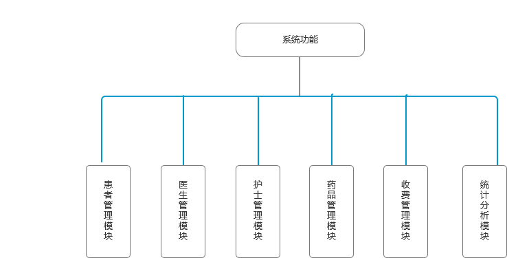

# 医院信息管理系统详细设计
### 一.引言
医院信息管理系统（Hospital Information Management System，HIMS）是现代化医院运营的必要基础设施，它整合了医院的各个业务流程，提高了医疗服务的效率和质量，同时也为医院的管理决策提供了有力的数据支持。本详细设计文档旨在描述医院信息管理系统的各个功能模块、数据库设计、界面设计以及技术实现细节，为系统的开发提供具体的指导。
### 二.系统概述
 **系统目标**
提高医院的医疗服务质量和效率。
实现医院信息的数字化管理，提高信息的准确性和及时性。
为医院的管理决策提供数据支持。

 **系统功能**
 
### 三.功能模块设计
（一）患者管理模块
|名字|功能描述|输入数据|输出数据|
|---|---|---|---|   
|患者信息登记|记录患者的基本信息|患者基本信息|患者信息记录|
|就诊记录查询|查询患者的就诊记录|患者身份证号或就诊卡号|患者就诊记录|

（二）医生管理模块
|名字|功能描述|输入数据|输出数据|
|---|---|---|---|
医生信息登记|记录医生的基本信息|医生基本信息|医生信息记录||
|排班管理|安排医生的出诊时间和科室|医生姓名、出诊时间、科室|医生排班表|
|处方开具|医生为患者开具处方|患者就诊信息、药品信息|处方记录|

（三）护士管理模块
|名字|功能描述|输入数据|输出数据|
|---|---|---|---|
|护理记录登记|记录患者的护理情况|患者护理信息|护理记录|
|医嘱执行|执行医生的医嘱|医嘱信息|医嘱执行记录|

（四）药品管理模块
|名字|功能描述|输入数据|输出数据|
|---|---|---|---|
|药品库存管理|记录药品的库存情况|药品入库信息、药品出库信息|药品库存记录|
|药品采购|根据药品库存情况和临床需求，制定药品采购计划|药品库存信息、临床需求信息|药品采购计划|
|药品发放|根据医生的处方，发放药品给患者|处方信息|药品发放记录|

（五）收费管理模块
|名字|功能描述|输入数据|输出数据|
|---|---|---|---|
|费用结算|计算患者的医疗费用|患者就诊信息、收费项目信息|费用结算单|
|医保报销|根据医保政策，为患者办理医保报销手续|患者医保信息、费用结算单|医保报销单|

（六）统计分析模块
|名字|功能描述|输入数据|输出数据|
|---|---|---|---|
|门诊统计|统计门诊的就诊人数、病种分布、医生工作量等|门诊就诊记录|门诊统计报表|
|住院统计|统计住院的患者人数、病种分布、平均住院天数、费用等|住院就诊记录|
住院统计报表|
|药品统计|统计药品的采购金额、销售金额、库存金额等|药品库存记录、药品销售记录|药品统计报表|
### 四.数据库设计
*概念设计*

实体：患者、医生、护士、药品、科室、收费项目等。
关系：患者与医生之间的就诊关系、医生与科室之间的所属关系、药品与科室之间的使用关系等。

*逻辑设计*
* 表结构设计：根据概念设计的结果，设计数据库表结构，包括表名、字段名、数据类型、约束条件等。
* 关系设计：设计表之间的关系，包括一对一、一对多、多对多等。
*物理设计*
* 数据库选型：根据系统的需求和性能要求，选择合适的数据库管理系统。
* 存储结构设计：设计数据库的存储结构，包括表空间、索引、分区等。
### 五.界面设计
`用户界面风格`
采用简洁、直观的设计风格，方便用户操作。
界面布局合理，功能分区明确。

*界面元素设计*
* 菜单：提供系统的主要功能入口。
* 工具栏：提供常用功能的快捷操作按钮。
* 表单：用于输入和显示数据。
* 报表：用于显示统计分析结果。
### 六.技术实现
*开发技术*
* 前端技术：采用 HTML、CSS、JavaScript 等技术实现用户界面。
* 后端技术：采用 Java、Python 等编程语言和相关框架实现系统的业务逻辑和数据管理。

`技术架构`
采用 B/S 架构，用户通过浏览器访问系统。
系统采用分层架构，包括表示层、业务逻辑层、数据访问层等。
*数据存储*
采用关系型数据库管理系统存储数据，如 MySQL、Oracle 等。
### 七.系统测试
`测试计划`
制定系统测试计划，包括测试范围、测试方法、测试用例等。

`测试用例`
设计根据系统的功能模块，设计测试用例，覆盖系统的各种功能和业务场景。

`测试执行`
照测试计划和测试用例，执行系统测试，记录测试结果。

`测试报告`
编写测试报告，总结测试结果，提出改进建议。
### 八.系统部署
*部署环境*
* 服务器：选择合适的服务器硬件和操作系统，如 Windows Server、Linux 等。
* 数据库：安装和配置数据库管理系统。
* 应用服务器：安装和配置应用服务器软件，如 Tomcat、JBoss 等。

`部署步骤`
将系统代码部署到应用服务器上。
配置数据库连接信息。
启动应用服务器，测试系统是否正常运行。
### 九.系统维护
`数据备份与恢复`
定期备份数据库数据，以防止数据丢失。
制定数据恢复计划，确保在数据丢失时能够及时恢复数据。

`系统升级与优化`
定期对系统进行升级，修复漏洞，提高系统的性能和稳定性。
根据用户的反馈和需求，对系统进行优化和改进。

`用户培训与技术支持`
为用户提供系统培训，帮助用户熟悉系统的操作和使用。
提供技术支持，及时解决用户在使用系统过程中遇到的问题。
### 十.总结
医院信息管理系统是一个复杂的系统工程，需要综合考虑医院的业务需求、技术实现、数据安全等多个方面。本详细设计文档对医院信息管理系统的各个功能模块、数据库设计、界面设计以及技术实现细节进行了详细的描述，为系统的开发提供了具体的指导。在系统的开发过程中，还需要不断地进行测试、优化和改进，以确保系统的质量和稳定性，为医院的信息化建设提供有力的支持。
 